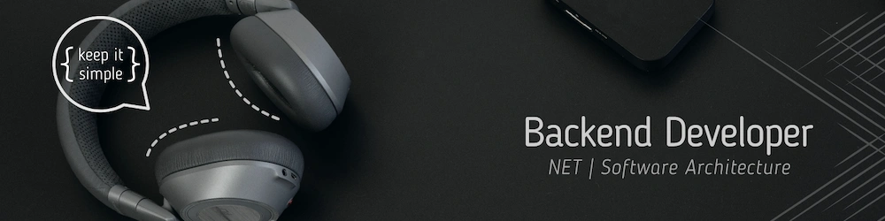

<h2 align="center">¡Hola! Soy Juan 👋</h2>

Desarrollador Backend con 4 años de experiencia en .NET (C#). Me enfoco en diseñar software de calidad que transforme ideas en soluciones escalables y eficientes, aplicando principios de arquitecturas limpias y código limpio.

A lo largo de mi trayectoria, he desarrollado módulos importantes de negocio y optimizado flujos de CI/CD, logrando reducir tiempos hasta en un 50%.

### Stack principal

Lenguajes:

Arquitecturas y patrones:

Herramientas:

<h2 align="center">Conecta conmigo 🤝</h2>

    

