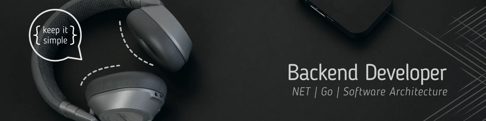

<h2 align="center">¡Bienvenid@ 👋!</h2>

Soy un apasionado por crear soluciones de software escalables, que generen valor a las personas y las organizaciones.

Me gusta ir más allá del código, comprendiendo el propósito detrás de cada decisión técnica y su impacto en la experiencia del usuario final.

### Actualmente aprendiendo
- Diseño de arquitecturas limpias y escalables.
- Go como segundo lenguaje backend.
- Fundamentos de soluciones en la nube (AWS)

### Stack principal

          
    
    
    
    
    

### En aprendizaje / proyección

    
    

<h2 align="center">Conecta conmigo 🤝</h2>

<section align="center">
    
</section>
